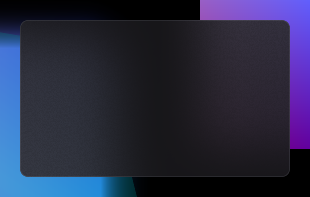
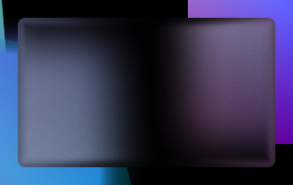

# Overlays

Void has two overlay concepts:

1. **Menu-level overlays**: things rendered as part of the menu tree
2. **Top-level custom overlays**: standalone overlay windows driven by callbacks

The sample creates two custom overlays in `add_widgets()`.

## Creating a custom overlay

```cpp
auto b = instance.get_builder();

b.overlay()
  .config("test_overlay")
  .liquid_glass(false)
  .make_resizable(true)
  .pos(0.8f, 0.4f)
  .size(200.f, 120.f)
  .min(100.f, 50.f)
  .max(400.f, 300.f)
  .on_render([](vo::void_* instance, vo::custom_overlay& overlay) {
      // draw + style data
  })
  .on_update([](vo::void_* instance, vo::custom_overlay& overlay) {
      // per-frame update
  });
```

## “Follow the menu” overlay

The sample uses `overlay(true)` to create an overlay that tracks the menu position and animates with menu alpha:

```cpp
b.overlay(true)
  .make_movable(false)
  .clamp_in_window(false)
  .on_render([](vo::void_* instance, vo::custom_overlay& overlay) {
      const auto& menu_pos = instance->pos();
      overlay.set_pos_scaled({ menu_pos.x + menu_pos.w + offset, menu_pos.y });
      overlay.set_animation(instance->alpha());
  });
```

## Input callbacks

Custom overlays can receive input via:

```cpp
.on_input([](vo::void_* instance, vo::custom_overlay& overlay, const vo::input_base& input) {
    return vo::input_response::empty();
});
```

They can also be toggled “input enabled”:

```cpp
overlay.toggle_input(true_or_false);
```

## Liquid glass background

A custom overlay can render using the “liquid glass” effect via `liquid_glass(true)`,
and by configuring the overlay data in `on_render()`.

The sample shows updating:
- rounding
- border/background colors
- `liquid_glass_size`
- `liquid_glass_color`

Screenshots from the repo:

- Default background  
  
- Liquid glass effect  
  
