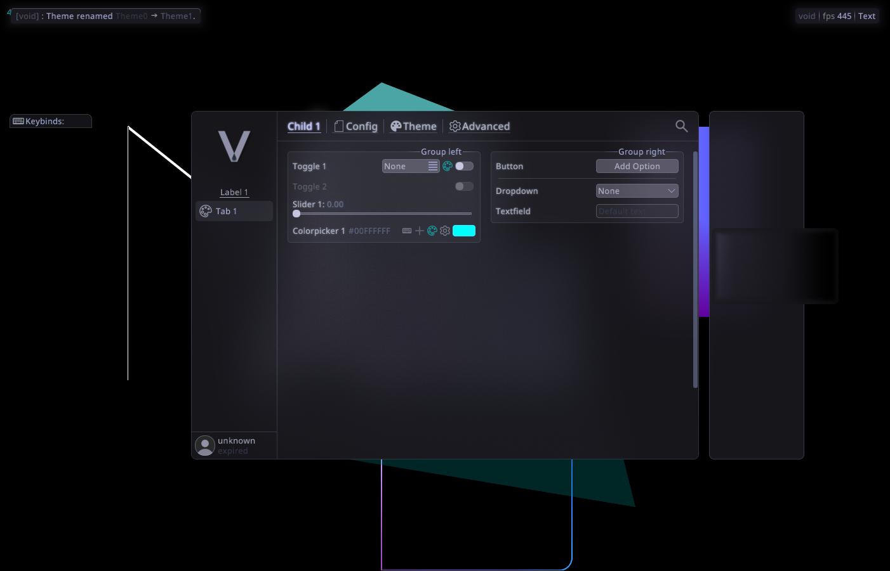
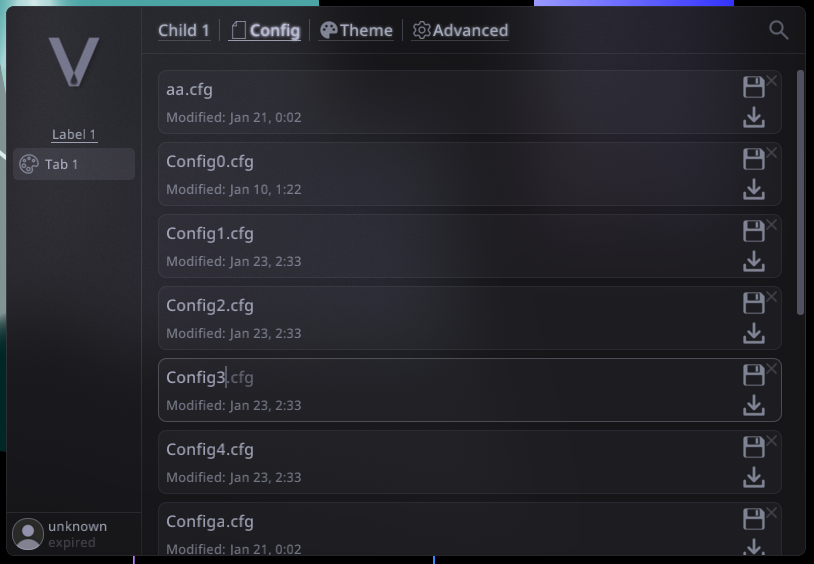

# Void

A C++ **menu + overlay framework** built around a fluent **builder API** (tabs → child tabs → groups → widgets).
It includes:

- Config persistence for builder widgets (opt-out per widget)
- Theme system
- Notifications
- Keybind widgets
- Watermark components
- Custom overlay windows (including a “liquid glass” effect)

## Gallery



**Config tab (with different theme)**  


**Overlay backgrounds**
- Default background  
  
- Liquid glass effect  
  

## Documentation

Start here: **[`docs/index.md`](docs/index.md)**

Key pages:
- [Getting started](docs/getting_started.md)
- [Builder overview](docs/builder.md)
- [Widgets](docs/widgets.md)
- [Overlays](docs/overlays.md)

## Building (Premake / Visual Studio)

Void ships with a premake module: [`premake/void.lua`](premake/void.lua). It creates two static libs:

- `void`
- `resources`

Void depends on `r2` and one of its backends (`d3d11` or `opengl`).

Minimal premake wiring pattern:

```lua
-- prerequisites:
--   include("<path-to-r2>/premake/r2.lua")
--   include("<path-to-void>/premake/void.lua")

group "thirdparty"
r2.add_projects({
  base = r2_dir,
  backend = "d3d11",        -- or "opengl"
  build_root = build_root,
  int_root = int_root,
})

group "void"
void.add_projects({
  base = void_dir,
  r2_dir = r2_dir,
  backend = "d3d11",        -- must match r2 backend
  build_root = build_root,
  int_root = int_root,
})
```

Your executable should link against:
- `void`
- `resources`
- the relevant `r2` projects / backend

## Minimal usage

See the full reference integration in [`TestRun/main.cpp`](TestRun/main.cpp).

A tiny sketch:

```cpp
#include <void/void.h>

vo::void_ ui;

// configure
ui.options().set<vo::options::option_MenuMSAA>(false);

// build widgets before init
{
    auto b = ui.get_builder();
    auto tab = b.tab("Tab 1");
    auto child = tab.child("Child 1");

    static bool enabled = false;
    child.left_group("Group").toggle("Enabled", enabled);
}

// init with platform/backend init data (see TestRun)
ui.init(pinit, binit);
```

## License

See [LICENSE](LICENSE) and submodules for license details.
